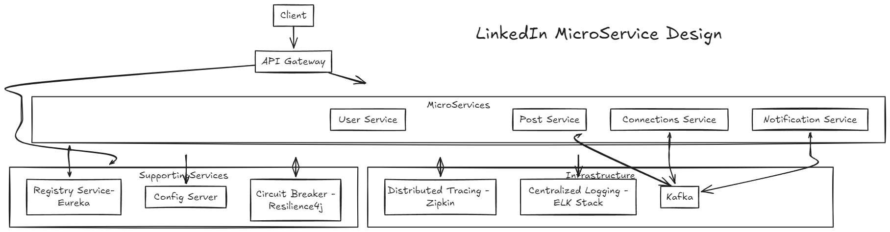

# 📘 LinkedIn Clone – Microservices Architecture

A LinkedIn-style social platform built using Java and Spring Boot microservices, featuring scalable and distributed design with Kafka, Redis, Eureka, Docker, and centralized configuration and logging tools.

---

### 🚀 Tech Stack

- **Backend**: Java, Spring Boot, Spring Cloud, Spring Data JPA
- **Microservices**: Eureka, Spring Cloud Config, Resilience4j
- **Messaging**: Apache Kafka
- **Containers**: Docker, Docker Compose
- **Observability**: ELK Stack, Zipkin
- **Database**: PostgreSQL / MySQL (based on service)
- **Others**: Redis, Kafka UI, Logstash, Maven

---

### 🧩 Microservices Included

| Service Name         | Description                                  |
|----------------------|----------------------------------------------|
| `user-service`       | Manages user profiles and authentication     |
| `post-service`       | Handles posts, likes, and comments           |
| `connections-service`| Manages user connections (follow system)     |
| `emailService`       | Sends email notifications                    |
| `uploader-service`   | Handles media uploads                        |
| `api-gateway`        | Routes external requests to microservices    |
| `discovery-server`   | Eureka server for service registry           |
| `config-server`      | Centralized configuration management         |

---

### 📦 Setup Instructions

#### 1. Clone the Repository

```bash
git clone https://github.com/premtsd-code/LinkedIn.git
cd LinkedIn
```

#### 2. Run with Docker Compose

Make sure you have Docker and Docker Compose installed.

```bash
docker-compose up --build
```

This will spin up all services including Kafka, Kafka UI, Eureka, Config Server, and your microservices.

---

### 📂 Project Structure

```
LinkedIn/
├── api-gateway/
├── config-server/
├── connections-service/
├── discovery-server/
├── emailService/
├── post-service/
├── uploader-service/
├── user-service/
├── logstash/
├── docker-compose.yml
└── .gitlab-ci.yml
```

---

### 🔧 Configuration

- Centralized configs are managed via **Spring Cloud Config Server**
- Service discovery with **Eureka**
- **Kafka** is used for communication between microservices
- **Redis** can be used for caching user data or tokens
- Logging is routed to **Logstash** → **Elasticsearch** → **Kibana**

---

### 📊 Monitoring & Debugging

- **Kafka UI**: Available at `http://localhost:8090`
- **Eureka Dashboard**: Usually `http://localhost:8761`
- **Zipkin** (if integrated): `http://localhost:9411`
- **Kibana**: Accessible on `http://localhost:5601` (when ELK is running)

---

### 🖼 Architecture Diagram



---

### 📃 License

This project is licensed under the [MIT License](LICENSE).
